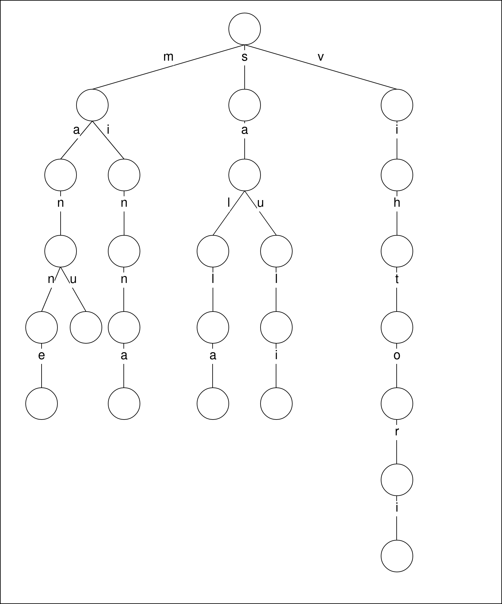

# Question 1

In order to build the inverted index for a document collection, the first step is to tokenize the text; however, we can say that it is already tokenize. The second step is to perform linguistic processing on the tokens in order to normalize them; however, the words are already normalized.
We can then proceed with the postings generation; at this step, the result is the following table:

| **term** | **docId** |  | **term** | **docId** |
|---|---|---|---|---|
| new | 1 |  | in | 3 |
| pants | 1 |  | pants | 3 |
| sales | 1 |  | sales | 3 |
| top | 1 |  | in | 3 |
| forecasts | 1 |  | july | 3 |
| pants | 2 |  | july | 4 |
| sales | 2 |  | new | 4 |
| rise | 2 |  | pants | 4 |
| in | 2 |  | sales | 4 |
| july | 2 |  | rise | 4 |
| increase | 3 |  |  |  |

Then we need to sort the postings:

| **term** | **docId** |  | **term** | **docId** |
|---|---|---|---|---|
| forecasts | 1 |  | pants | 2 |
| in | 2 |  | pants | 3 |
| in | 3 |  | pants | 4 |
| in | 3 |  | rise | 2 |
| increase | 3 |  | rise | 4 |
| july | 2 |  | sales | 1 |
| july | 3 |  | sales | 2 |
| july | 4 |  | sales | 3 |
| new | 1 |  | sales | 4 |
| new | 4 |  | top | 1 |
| pants | 1 |  |  |  |

Then we count the document frequency; after this step, the result is the following:

| **term** | **doc freq** | **inv list** |
|---|---|---|
| forecasts | 1 | 1 |
| in | 2 | 2,3 |
| increase | 1 | 3 |
| july | 3 | 2,3,4 |
| new | 2 | 1,4 |
| pants | 4 | 1,2,3,4 |
| rise | 2 | 2,4 |
| sales | 4 | 1,2,3,4 |
| top | 1 | 1 |

And finally we draw the inverted index (the number in the square brackets before the arrow is the document frequency; the numbers in the square brackets after the arrow are the postings):

```
forecasts[1] -> [1]
in[2] -> [2][3]
increase[1] -> [3]
july[3] -> [2][3][4]
new[2] -> [1][4]
pants[4] -> [1][2][3][4]
rise[2] -> [2][4]
sales[4] -> [1][2][3][4]
top[1] -> [1]
```

**Note:** what I did was the actual procedure, but this collection of documents is small so it could be done in only one step (as I did in the next question).

# Question 2

## Task a

The term-document incidence matrix for the collection is the following:

| **term** | **Doc 1** | **Doc 2** | **Doc 3** | **Doc 4** |
|---|---|---|---|---|
| approach | 0 | 0 | 1 | 0 |
| breakthrough | 1 | 0 | 0 | 0 |
| drug | 1 | 1 | 0 | 0 |
| for | 1 | 0 | 1 | 1 |
| hopes | 0 | 0 | 0 | 1 |
| in | 0 | 0 | 1 | 0 |
| new | 0 | 1 | 1 | 1 |
| our | 0 | 0 | 1 | 0 |
| peace | 1 | 1 | 1 | 1 |
| process | 0 | 0 | 0 | 1 |
| time | 0 | 0 | 1 | 0 |

## Task b

The inverted index representation of the collection is the following:

```
approach[1] -> [3]
breakthrough[1] -> [1]
drug[2] -> [1][2]
for[3] -> [1][3][4]
hopes[1] -> [4]
in[1] -> [3]
new[3] -> [2][3][4]
our[1] -> [3]
peace[4] -> [1][2][3][4]
process[1] -> [4]
time[1] -> [3]
```

## Task c

The results for the queries are the following:

- peace **AND** drug: `Doc 1, Doc 2`
    - Explanation: the query is a simple cunjunctive query. `peace` is in Doc 1, Doc 2, Doc 3 and Doc 4, `drug` is in Doc 1 and Doc 2, the intersection is the answer
- for **AND NOT** (drug **OR** approach): `Doc 4`
    - Explanation: `for` is in Doc 1, Doc 3 and Doc 4, `drug` is in Doc 1 and Doc 2 (thus we must delete Doc 1 from the result because **AND NOT** is a disjunction), `approach` is in Doc 3 (thus we must delete Doc 3). The result is then `Doc 4`

# Question 3

Assuming that x and y are the length of the postings lists:

a. The query Brutus **AND NOT** Caesar **can** still be ran in time $O(x+y)$; a sketch of algorithm is based on the one we went through during the lecture, but instead of saving the documents that are present in both postings lists we take the documents that are **not present** in both lists;
b. The query Brutus **OR NOT** Caesar **cannot** be ran in time $O(x+y)$: in fact, this query tries to find all the documents in which Brutus or "everything else except Caesar" are present, and in order to do that all the documents must be checked. The complexity for this query is then $O(n)$, where $n$ is the number of documents.

# Question 4

A simple and effective optimization is to process in order of increasing frequency of the elements of the query. Unlike what we went through during the lecture, this time we don't have single postings lists but unions of them; however, the procedure is always the same. To be more precise, the three unions are:

- tangerine **OR** trees, of size $46653+316812=\bold{363465}$
- marmelade **OR** skies, of size $107913+271658=\bold{379571}$
- kaleidoscope **OR** eyes, of size $87009+213312=\bold{300321}$

The suggested order is then: (kaleidoscope **OR** eyes) **AND** (tangerine **OR** trees) **AND** (marmelade **OR** skies).

# Question 5

An algorithm based on the intersection algorithm could be the following:

```python
Union(p, q)
1  answer <- { }
2  while p != null and q != null do
3  if docID(p) = docID(q) then
4    Add(answer , docID(p))
5    p <- next(p)
6    q <- next(q)
7  else if docID(p) < docID(q) then
8    Add(answer , docID(p))
9    p <- next(p)
10 else
11   Add(answer, docID(q))
12   q <- next(q)
13  end while
14  return answer
```

That is basically the same of the intersection (from the code perspective) but, instead of adding to the answer only the document that has both `p` and `q`, this algorithm also adds the documents that have only one of them.

# Question 6

# Question 7

# Question 8

{width=400px}